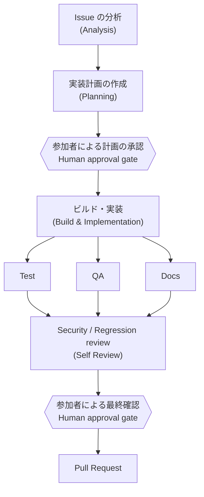

## CDK Contribution Skill とは

[CDK Contribution Skill](https://github.com/cdklabs/cdk-contribution-skill) は、GitHub Issue の分析から実装、テスト、セルフレビュー、Pull Request の準備までを AI エージェントと段階的に進めるための Agent Skill です。

AWS CDK チームの知見をまとめた複数の SOP (標準作業手順書) を使い、次の流れをオーケストレーションします。

Skill は各フェーズの成果物 (`01-analysis.md` 〜 `05-review.md`) を `.contributions/<ISSUE_NUMBER>/` に保存します。分析や判断の根拠を後から確認できるため、エージェントとの会話だけで進める場合よりレビューしやすくなります。

## Skill がすること・しないこと

### すること

- Issue、関連コード、既存テストの調査
- 実装方針とテスト計画の提案
- 承認済み計画に基づくコード変更
- unit test、integration test、lint、ビルドの実行
- セキュリティと後方互換性のセルフレビュー
- Pull Request に必要な説明の作成

### しないこと

- 参加者に代わって仕様や設計の最終判断をすること
- 内容を理解していないコードを自動的に提出すること
- 人間のレビューを省略すること
- 品質を確認せず大量の Pull Request を作成すること

:::caution[Pull Request の責任]

Skill が生成したコードや文章も、提出者自身のコントリビューションです。変更内容、テスト結果、AWS リソースへの影響を理解し、自分で説明できる状態にしてから Pull Request を提出してください。

:::

## このワークショップでの安全な実行先

公式 Skill は本家の `aws/aws-cdk` を対象としていますが、本ワークショップでは安全のため、次の演習用リポジトリだけを使用します。

- <https://github.com/jaws-ug-cdk/aws-cdk-for-workshop>

演習用リポジトリのルートにはワークショップ専用の `AGENTS.md` が含まれます。Kiro CLI はリポジトリルートの `AGENTS.md` を自動的に context へ読み込むため、Skill 内に本家リポジトリへの参照があっても、`AGENTS.md` に書かれたワークショップのルール (提出先の制限や承認ポイント) が優先されます。

:::danger[本家リポジトリには提出しない]

このワークショップ中は `aws/aws-cdk` を remote に追加したり、同リポジトリを宛先とする Pull Request や Issue、コメントを作成したりしないでください。提出先は必ず `jaws-ug-cdk/aws-cdk-for-workshop` であることを確認します。

:::

## 参加者が確認するチェックポイント

エージェントが先へ進もうとしても、次のチェックポイントでは必ず一度止めます。

1. **分析後**: Issue の目的と影響範囲を自分の言葉で説明できるか
2. **計画承認前**: 変更対象、API 設計、unit test、integration test が妥当か
3. **AWS デプロイ前**: 作成されるリソース、料金、削除方法を理解したか
4. **PR 提出前**: 差分とテスト結果を確認し、提出先が演習用リポジトリか

次は[開発環境のセットアップ](/cdk-conf-2024-contribute-workshop/1-環境構築/setup/)へ進み、Kiro CLI と Skill を準備します。
