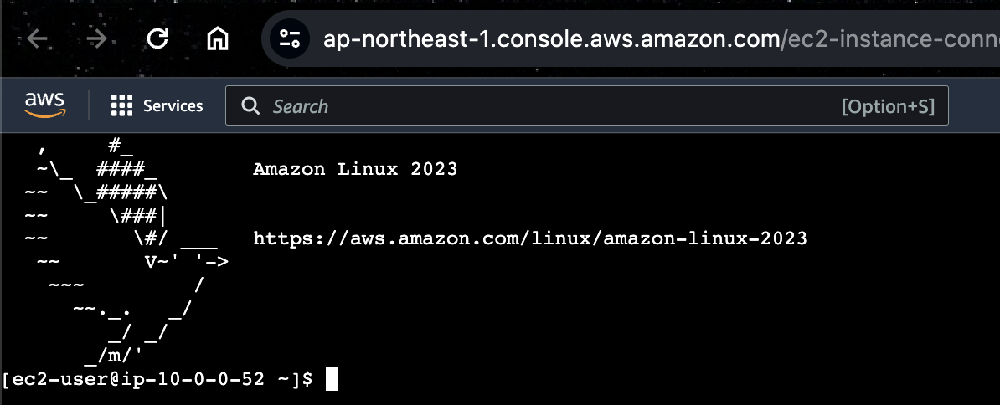
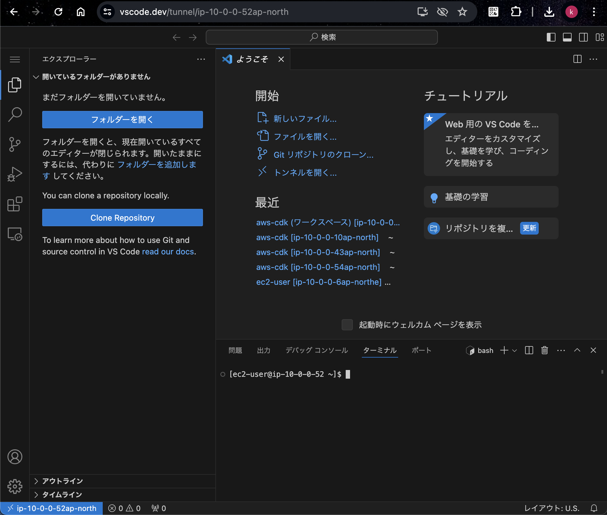

ここでは開発環境となるEC2インスタンスをセットアップします。
EC2への接続にはEC2 instance connect endpointを利用します。

## 構築手順

### スタックのデプロイ

[CdkConferenceStack.json](https://github.com/jaws-ug-cdk/cdk-conf-2024-contribute-workshop/blob/main/CdkConferenceStack.json)を用いて、[Cloudformationのマネジメントコンソール](https://console.aws.amazon.com/cloudformation/home#/stacks?filteringText=&filteringStatus=active&viewNested=true)からスタックのデプロイを行います。

Create stack > With new resources (standard) > Choose an existing template > Upload a template file > Choose file > CdkConferenceStack.json > Next > Stack name: `CdkConferenceStack` > Next > `I acknowledge that AWS CloudFormation might create IAM resources.` にチェック > Next > Submit

およそ5分ほどでデプロイが完了します。

### EC2へのアクセス

[AWSコンソールのEC2管理画面](https://console.aws.amazon.com/ec2/home#Instances:instanceState=running)にアクセスし、EC2インスタンスにEIC Endpointを経由して接続します

Instance IDを選択 > Connect > EC2 Instance Connect > "Connect using a Private IP" ボタンを選択 > "EC2 Instance Connect Endpoint" に値が指定されていることを確認 > Connect

以下の画面が表示されればOKです。



### VSCode Serverへのブラウザアクセスの確立

EC2上で以下のコマンドを実行し、VSCode Serverを起動します。

```sh
[ec2-user@ip-10-0-0-23 ~]$ code tunnel service install
[2024-06-10 02:10:42] info Using GitHub for authentication, run `code tunnel user login --provider <provider>` option to change this.
To grant access to the server, please log into https://github.com/login/device and use code 3811-9932
```

続いて、ブラウザで[https://github.com/login/device](https://github.com/login/device)にアクセスし、コードを入力し認証を完了させます。

- 上記の例では'3811-9932'を入力 > Continue > Continue > Authorize-Visual-Studio-Code

EC2に戻り、改めて`code tunnel`を実行し、以下のように表示されたURL (https://vscode.dev/tunnel/ip-{pricateIp}{region}) をブラウザで開きます。

```sh
[ec2-user@ip-10-0-0-23 ~]$ code tunnel
*
* Visual Studio Code Server
*
* By using the software, you agree to
* the Visual Studio Code Server License Terms (https://aka.ms/vscode-server-license) and
* the Microsoft Privacy Statement (https://privacy.microsoft.com/en-US/privacystatement).
*
[2024-06-10 02:11:44] info Creating tunnel with the name: ip-10-0-0-23ap-north
[2024-06-10 02:11:44] info Open this link in your browser https://vscode.dev/tunnel/ip-10-0-0-23ap-north

Connected to an existing tunnel process running on this machine.

Open this link in your browser https://vscode.dev/tunnel/ip-10-0-0-23ap-north
```

VSCodeが開くので、「このトンネルを開始するために使用したアカウントの種類は何ですか？」でGitHubを選択します。

このとき、再度GitHubの認証画面が開くことがありますので、`Authorize`を押下します。

ターミナルを開けば準備完了です。



## Kiro CLI と GitHub CLI の準備

ワークショップ用の CloudFormation テンプレートでは、Kiro CLI と GitHub CLI (`gh`) が EC2 にインストールされます。ターミナルでバージョンを確認します。

```sh
kiro-cli --version
gh --version
```

`kiro-cli` が見つからない場合は、[Kiro CLI の公式手順](https://kiro.dev/docs/cli/installation/)に従ってインストールし、ターミナルを開き直してください。インストール先は `~/.local/bin` です。

```sh
curl -fsSL https://cli.kiro.dev/install | bash
```

### Kiro CLI の認証

Kiro CLI を起動します。

```sh
kiro-cli
```

初回起動時は案内に従ってブラウザ認証を完了します。起動後は Default agent を使用してください。

### CDK Contribution Skill のインストール

Kiro CLI に次のメッセージを送ります。

```text
Install https://github.com/cdklabs/cdk-contribution-skill to my Kiro skills.
```

インストールが完了したら `/context show` を実行し、`cdk-contribution-skill` が利用可能な Skill に含まれていることを確認します。

:::note

Default agent は `~/.kiro/skills/` の Skill とリポジトリルートの `AGENTS.md` を自動的に読み込みます。Custom agent を利用する場合は Skill の resource 設定が別途必要なため、このワークショップでは Default agent を使用します。

:::

### GitHub CLI の認証

Kiro CLI を一度終了し、ターミナルで GitHub CLI を認証します。

```sh
gh auth login --web --git-protocol https

gh auth status
```

ブラウザに表示された案内に従って、ご自身の GitHub アカウントを認証してください。認証情報やトークンをチャットへ貼り付けないでください。

## 演習用リポジトリと Git LFS について

本ワークショップで使用する演習用リポジトリ ([jaws-ug-cdk/aws-cdk-for-workshop](https://github.com/jaws-ug-cdk/aws-cdk-for-workshop)) は、**Git LFS (Large File Storage) を使用していません**。本家 `aws/aws-cdk` で LFS 管理されている一部の integration test 用スナップショット資材 (`asset.*.zip` など約 200 ファイル) は、このリポジトリでは実体のないポインタファイルのままになっています。

本ワークショップで扱う SNS / ECR モジュールのビルド、unit test、integration test には影響ありません。ただし、対象外のモジュールの integration test をスナップショット資材ごと実行することはできない点に注意してください。`git lfs pull` を実行する必要はありません (実行してもオブジェクトは取得できません)。

これでエージェントを利用する準備は完了です。次は[コントリビュートの流れとルール](/cdk-conf-2024-contribute-workshop/2-コントリビュートの流れとルール/contribution-flow-rule/)を確認します。
