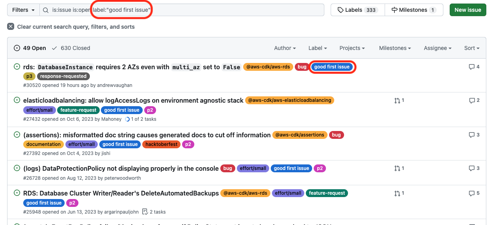
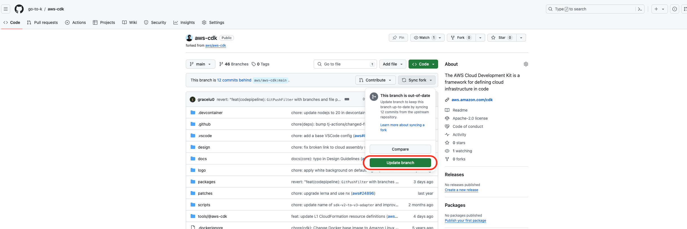
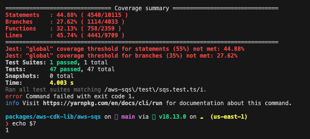
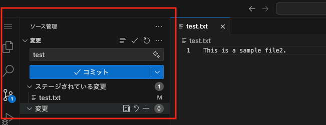
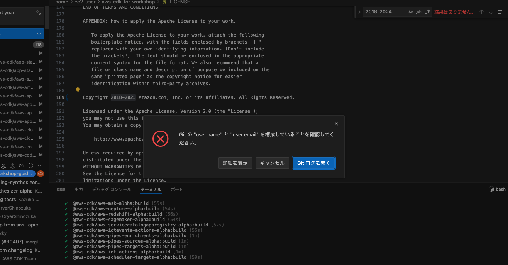
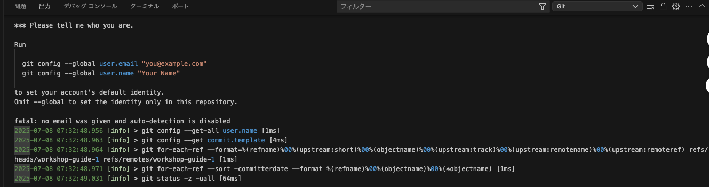
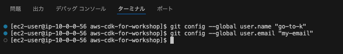
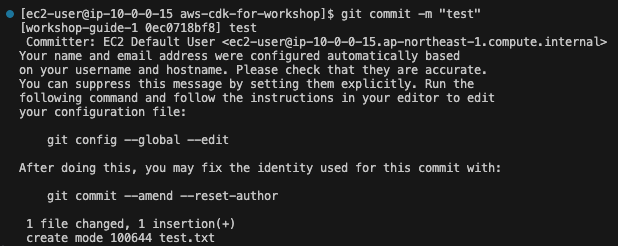
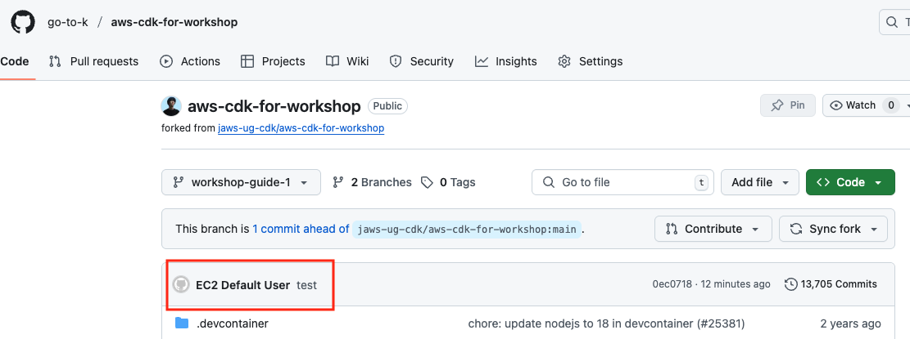
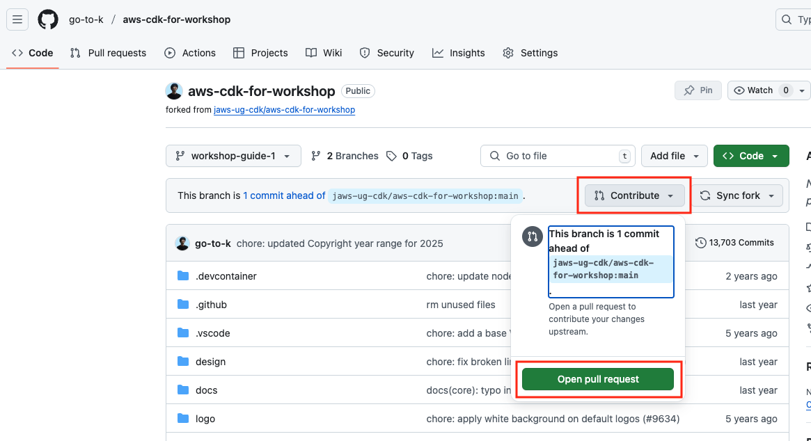

## コントリビュートの流れ

実際に AWS CDK にコントリビュートする際は、主に以下のフローで行います。

### 着手する issue を探したり、Pull Request を出す内容を決める

まずは本家リポジトリの [issue](https://github.com/aws/aws-cdk/issues) から探してみましょう。

ラベルでカテゴリをフィルタリングすることもできます。`p1`, `p2`のような優先度ラベル(`p1`は回避不可能なバグなどでメンテナーレビュー対象になり、`p2`は回避可能なバグや機能追加要望などでまずはコミュニティレビュアーによるレビュー対象になるもの)や、AWS サービスごとのラベル、また`effort/small`, `effort/medium`などの影響範囲によるラベルがあります。

また、`good first issue`という、**初めてコントリビュートする人におすすめのラベル**もあるので、まずはこちらで絞り込んでみると良いかもしれません。



もしくはもともとコントリビュートしたい内容がある場合はそれでも構いません。しかし、**すでにその内容と同じ issue や Pull Request が提出されている可能性**もあるので、**いったん既存の issue や Pull Request を探してみましょう**。

該当する内容の issue や Pull Request が存在しない場合、issue を起票してから Pull Request を提出しても良し、そのまま issue を紐付けずに Pull Request を提出するのもありです。

もし提出しようと思っているコントリビュート内容が、果たして出して良いものかどうか不安がある場合、まずは issue を起票して、メンテナーに意見をもらうのも良いでしょう。

### リポジトリのフォーク・クローン・ブランチのチェックアウト・ビルド

- [フォークからビルドまで](/cdk-conf-2024-contribute-workshop/3-フォークからビルドまで/fork-build)を参照
  - フォーク・クローンは初回のコントリビュート時のみで OK
  - 複数の Pull Request を管理するため、上記リンクの通り、Pull Request ごとにブランチを切っておきましょう
- ※upstream(aws-cdk 本家)の main ブランチに更新があった場合、自分のフォークしたリポジトリに反映しておく
  - こちらは 2 回目以降のコントリビュートの際、またはフォークをしてから時間が経った場合に行います
  - GitHub 上のフォークした自身のリポジトリで `Update branch` ボタンで更新し、その後ローカルの main ブランチで `git pull` をします
    - upstream のブランチへの追跡は git コマンドでも可能ですが省略
  - ブランチを切る際は、更新後の main ブランチから切ると良いでしょう
    - ブランチを切った後に本家の更新を反映するには、`git pull origin main`コマンドを使用します。(git fetch + merge でも可)
    - また 2 回目以降のコントリビュートの際は、ローカルでビルドした時から変更があることが多いため、再度ビルドをしておくと良いでしょう
  - 

### ソースコードの変更

解決したい内容に従って、実際にソースコードを変更します。具体的なファイルは解決したい内容によって選択してください。

機能追加やバグ修正では、unit テストや integ テストのコードを追加して、変更が正しく動作することを確認します。

後述しますが、機能追加の Pull Request では README ファイルの更新も必要です。

### 再ビルド

ソースコードを変更した場合、後述する integration テストなどでテスト対象のモジュールを最新のコードとして実行するには再度ビルドをしておく必要があります。

なお、初回のクローン時に行った`lerna`によるビルドは様々な処理が実行されるため、時間がかかることがあります。

今回のソースコード変更で、もし TypeScript ファイルのみを変更した場合、`tsc`コマンドによって TypeScript ファイルから javascript ファイルへのトランスパイルのみを行うことでビルド時間を削減する方法もあります。

**ただしこれはあくまでトランスパイルのみをするためビルドとしては不十分なケースもあるので、何か不具合などが起きたら`lerna`コマンドの方を実行するようにしましょう。**

```sh
cd packages/aws-cdk-lib
yarn tsc
```

また、予め`yarn watch`コマンドを実行しておくことで、コードの変更を検知して自動でビルドすることも可能ですので、こちらもオススメです(詳細は[こちら](https://github.com/aws/aws-cdk/blob/main/CONTRIBUTING.md#yarn-watch-optional))。

```sh
cd packages/aws-cdk-lib
yarn watch & # runs in the background
```

他にも、`yarn build`コマンドでもビルドを行うことができます。

こちらのコマンドでも`lerna`同様に様々な処理が走り、次項で説明する lint なども含めたビルドが行われます。ビルド時にまとめて lint も実行したい場合には便利です。

```sh
cd packages/aws-cdk-lib
yarn build
```

### lint 実行

コードの文法・スタイルチェックを行うために、lint を実行できます。

こちらも`yarn watch`などと同じく、モジュールのルートディレクトリ(`packages/aws-cdk-lib`)で実行します。

```sh
cd packages/aws-cdk-lib
yarn lint
```

### unit テスト(単体テスト)実行

機能追加やバグ修正などでは、unit テスト(単体テスト)を実行して、変更が正しく動作することを確認します。

既存の挙動に変更がないかどうか、またバグ修正の際に新たにテストを追加した場合も同じようにテストを実行して確認します。

```sh
cd packages/aws-cdk-lib
yarn test
# またはテストファイル指定
yarn test aws-sqs/test/sqs.test.ts
```

なお、テストが成功してもカバレッジが指定の値を超えていない場合エラーになりますが、テスト自体が PASS していれば Pull Request としては問題ありません。



### integration テスト(統合テスト)実行

AWS CDK では、Pull Request の種類(詳細は後述)によって`integ-tests-alpha`モジュールによる integration テスト(統合テスト)を追加・変更する必要があります。ここでの integration テストとは、実際に AWS 環境に正しくデプロイできるかを確認するテストになります。

こちらでは integration テストファイル(TypeScript)をビルドし、javascript ファイルへトランスパイルされた`integ.xx.js`を実行することになります。(**自分の変更したコンストラクト側、つまり aws-cdk-lib モジュール側のファイルも事前にビルドしておく必要があります。**)

```sh
cd packages/@aws-cdk-testing/framework-integ
# integration ファイルのビルド/トランスパイルをして、javascript ファイルを生成
yarn tsc
# 実際に integration テストを実行する
yarn integ aws-sqs/test/integ.sqs.js # jsファイルが生成されていることを確認してから
```

こちらにより、実際に AWS CDK による AWS 環境へのデプロイを実行し、正しくデプロイできるかを確認することができます。

まずデプロイ前に`integ-tests-alpha`モジュール によって CloudFormation のテンプレートファイルが**スナップショットファイルとして**生成されます(同ディレクトリ内の`integ.sqs.js.snapshot`ディレクトリに保管)。

初めてそのテストのスナップショットを生成する場合、スナップショットのテンプレート生成とともに実際にデプロイが実行されます。すでに既存のスナップショットファイルがある場合で、そのスナップショットのテンプレートと差分がない場合、デプロイすらも実行されずに正常終了します。
もし既存のスナップショットから変更がある、つまり CloudFormation テンプレートに差分が生じた際は、デプロイが実行される前にテストコマンドがエラーで終了されます。

CloudFormation テンプレートに差分があるが、**それが機能追加やバグ修正による想定内の変更である場合**、`--update-on-failed`オプションによって、エラーを抑制し、既存のスナップショットファイルを更新することができます。その際、まず元のスナップショットの状態でのデプロイが実行され、その後、更新後のスナップショットの状態でのデプロイがスタック更新として実行されます。これが成功すればコマンドは正常終了します。

```sh
yarn integ aws-sqs/test/integ.sqs.js --update-on-failed
```

もしそれらのテンプレートに、**破壊的変更がある場合にもエラーが発生するため**、この場合はコンストラクト側のコードを変更し、破壊的変更がないように修正する必要があります。

※破壊的変更: 既存のリソースが削除されたり置換されてしまうようなケース

また、integration テストでは実際に AWS 環境にデプロイした後、スタックを自動で削除する仕様になっていますが、もしデプロイ後に作成したリソースをマネージメントコンソールなどで確認したい場合、`--no-clean`オプションを指定することで、スタックを自動削除しないようにすることができます。

```sh
yarn integ aws-sqs/test/integ.sqs.js --no-clean --update-on-failed
```

### Pull Request 提出

ここまでで、実際のコンストラクトコードの変更、またテストの実行が成功したら、GitHub に Pull Request を提出します。

まず、ローカルのブランチで、変更したファイルを push します。

```sh
git add . # もしくは実際に変更したファイルを直接指定
git commit -m "feat(sqs): add xxx property" # コミットメッセージは適宜変更
git push origin workshop-guide-1 # ブランチ名は適宜変更
```

> [!NOTE]
> VS Code 上でコミットをする際、以下のようなダイアログが出ることがあります。
>
> 
>
> 
>
> 
>
> その場合、ターミナルから、自分の Git 情報(`user.name`, `user.email`)を設定しましょう。
>
> ```sh
> git config --global user.name "my-username"
> git config --global user.email "my-email"
> ```
>
> 
>
> ターミナル上で`git commit`を実行する場合は、上記設定をせずとも、以下のようなメッセージが出ますがコミットは成功します。
>
> 
>
> しかし、そのまま push すると、以下のような匿名ユーザーのコミットになってしまうので、やはり上記のように`git config`によるユーザー設定をしておくことをお勧めします。
>
> 

そして、フォークしたリポジトリをブラウザで開くとこのようなダイアログが出力されているので、このまま GitHub 上で Pull Request を提出します。


> [!NOTE]
> もし出ていない場合、`Contribute`ボタンを押すと以下のようなパネルが開かれます。そこから`Open pull request`ボタンを押しましょう。
>
> 

Pull Request のルール(後述)に沿ってタイトルや本文を記載し、Pull Request を提出します。


## Pull Request ルール

Pull Request (PR) を提出する際のルールを以下に示します。

まず、PR タイトルですが、以下のように、`種類(モジュール): 説明`のような記載にしてください。

また基本的には、**全て小文字**にしてください。（固有名詞やプロパティ名などには大文字を使っても構いません：TLS, MySQL, `maxMessageSizeBytes`, etc...）

- feat(sqs): add `maxMessageSizeBytes` property for `Queue`

### Conventional Commits

最初の`feat` 部分には、今回の PR で変更する内容に沿って、[Conventional Commits](https://www.conventionalcommits.org/en/v1.0.0/) (feat, fix, chore, docs, test, etc...)に従って記載してください。

特に機能追加(feat)、バグ修正(fix)の場合は、**以下のファイルを差分に含める**必要があります。(含めない場合、**AWS CDK リポジトリで自動発火する CI でエラーになります**)

- feat
  - unit テスト
  - integration テスト + スナップショット
  - README
- fix
  - unit テスト
  - integration テスト + スナップショット

integration テストに関して、自分の変更した内容に関連するテストファイルがすでにあればそれを変更し、なければ自分で新規テストファイルを作成して、テストを実行します。integration テストファイル自体とそのスナップショットのどちらにも差分が発生していないと CI エラーになります。

### モジュール

`feat(sqs)`の`(sqs)`の部分には、変更した AWS サービスのモジュール名称を記載してください。

なお、以下のルールに注意してください。

- `aws-sqs`などの prefix の`aws-`部分は省略する
- alpha モジュールの場合の`-alpha`も省略する
  - `aws-apprunner-alpha` -> `apprunner`

### fix の場合の注意

バグ修正(fix)の場合、PR タイトルには、「このような変更をした」ではなく、「このようなバグがあった」という旨を記載してください。

- NG タイトル
  - fix(sqs): use `xxx` instead of `yyy`
- OK タイトル
  - fix(sqs): failed to create queue when `xxx` is specified

### 補足

- 実際の PR では、PR 提出後に自動で CodeBuild による CI(ビルド・lint・テスト・etc...) が走ります
  - **ワークショップでは PR 提出後の CI を提供していません**
- feat や fix では unit テスト、integration テスト、README(feat のみ) などの変更をしないと CodeBuild CI がエラーになりますが、変更内容に対してそれらは不要であると主張したい場合(たとえば unit テストのみで変更内容がカバーできる場合など)は、Pull Request のコメントで以下のようなコメントをすると、**メンテナーが不要と判断した場合にのみ**、差分に含めなくても良くなります
  - `Exemption Request: 理由`
  - ただし、なるべくこれは行わず、PR ルールに沿って変更を行うようにしましょう


## コントリビュートガイド・デザインガイド

コントリビュートをする際、今回のワークショップで説明できなかった注意点も多々あります。以下の公式リンクを参照してください。

- [CONTRIBUTING](https://github.com/aws/aws-cdk/blob/main/CONTRIBUTING.md)
- [DESIGN_GUIDELINES](https://github.com/aws/aws-cdk/blob/main/docs/DESIGN_GUIDELINES.md)

また、k.goto が個人で公開している資料にも注意点・実装 TIPS などが公開されているため、こちらも良ければご覧下さい。

- [AWS CDK コントリビュート TIPS](https://speakerdeck.com/gotok365/aws-cdk-contribution-tips)
