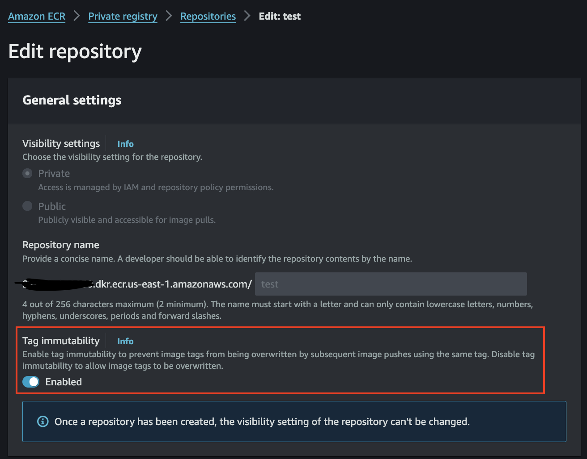

## 概要

ECR Repositoryではイメージタグの不変性(同一タグによる上書きを禁止)を有効化することができます。



[Cloudformation](https://docs.aws.amazon.com/AWSCloudFormation/latest/UserGuide/aws-resource-ecr-repository.html#cfn-ecr-repository-imagetagmutability)及び[CDKのL1コンストラクト](https://docs.aws.amazon.com/cdk/api/v2/docs/aws-cdk-lib.aws_ecr.CfnRepository.html#imagetagmutability)では `ImageTagMutability` というプロパティが提供されており、これを利用することでタグの不変性を設定することができます。

このパラメータはstring型ですが、許容される文字列は

- `MUTABLE` (デフォルト)
- `IMMUTABLE`

の2つのみです。

使用例:

```ts {2}
const repository = ecr.CfnRepository(this, 'MyRepository', {
  imageTagMutability: 'IMMUTABLE'
})
```

しかし、ワークショップ向けCDKのL2コンストラクト(ecr.Repository)では `imageTagMutability` がサポートされていません。そこで、L2コンストラクトに `imageTagMutability` プロパティを追加してみます。

## 目標

基本的な流れは[4-機能追加PR](/cdk-conf-2024-contribute-workshop/4-機能追加PRの作成/display-name)の作成と同じです。

加えて、今回は特定の文字列のみしか入力を許容しないようにするため、独自のenum型を作成してみましょう。

```ts {1-4,8}
export enum ImageTagMutability {
  MUTABLE = 'MUTABLE',
  IMMUTABLE = 'IMMUTABLE'
}

export interface RepositoryProps {
  ..., // 既存のプロパティ
  readonly imageTagMutability?: ImageTagMutability;
};
```

このように定義することで、L2コンストラクトは以下のように呼び出すことができます。

```ts {2}
const repository = new ecr.Repository(this, 'MyRepository', {
  imageTagMutability: ImageTagMutability.IMMUTABLE,
})
```

TypeScriptの型システムのおかげで、`imageTagMutability` には `MUTABLE` または `IMMUTABLE` のいずれかの文字列しか指定できないようになりました。

:::note

enum型を定義せずboolean型を受け取り、L2内で以下のように文字列に変換してL1に渡す方針も考えられます。

|Repositoryの`imageTagMutability`|true|false|
|-|-|-|
|CfnRepositoryの`imageTagMutability`|'IMMUTABLE'|'MUTABLE'|

どちらの方法も使いやすいですが、今回はenum型が好ましいと考えています。

理由としては、cloudformation側が文字列型のため、将来的に`IMMUTABLE`, `MUTABLE`以外の値を受け入れる可能性が無いとは言えず、その際に対応が容易なためです。

どんな引数の型が最適なのか、実際のPRではメンテナーと相談しながら進めていきましょう。

:::

以上より、今回のPRには以下の内容を含める必要があります。

- L2コンストラクト(packages/aws-cdk-lib/aws-ecr/lib/repository.ts)のコード変更
  - `ImageTagMutability` enum型の追加
  - `RepositoryProps`に`imageTagMutability`プロパティを追加
  - `Repository`クラスのconstructor関数中の`CfnRepository`クラスのインスタンス作成時に`imageTagMutability`プロパティを設定
- ユニットテスト(packages/aws-cdk-lib/aws-ecr/test/repository.test.ts)の追加
  - `imageTagMutability`プロパティがCloudformationテンプレートに正しく反映されるか
- 統合テスト(packages/@aws-cdk-testing/framework-integ/test/aws-ecr/test)の追加
  - `imageTagMutability`を設定したECR Repositoryが正しく作成されるか
- READMEの更新
  - 機能追加に関する説明を追加

:::tip[自信のある方へ]

この先の手順は読まず、[4-機能追加PR](/cdk-conf-2024-contribute-workshop/4-機能追加PRの作成/display-name)の流れを参考にしながらPRを作成してみてください。

:::

## 手順

### ブランチ作成

まずは、この機能追加用のブランチを作成します。

```sh
git switch -c add-image-tag-mutability
```

### L2コンストラクトのコード変更

#### `ImageTagMutability` enum型の追加

`aws-cdk/packages/aws-cdk-lib/aws-ecr/lib/repository.ts`を開き、`ImageTagMutability` enum型を追加します。

このとき、jsdocの記述も忘れないでください。

```ts {1-13}
/**
 * The tag mutability setting for your repository.
 */
export enum ImageTagMutability {
  /**
   * allow image tags to be overwritten.
   */
  MUTABLE = 'MUTABLE',
  /**
   * all image tags within the repository will be immutable which will prevent them from being overwritten.
   */
  IMMUTABLE = 'IMMUTABLE'
}
```

#### `RepositoryProps`へ`imageTagMutability`の追加

`aws-cdk/packages/aws-cdk-lib/aws-ecr/lib/repository.ts`を開き、`RepositoryProps`に`readonly`な`imageTagMutability`プロパティを追加します。

```ts {4-12}
// aws-cdk/packages/aws-cdk-lib/aws-ecr/lib/repository.ts
export interface RepositoryProps {
  ..., // 既存のプロパティ
  /**
   * The tag mutability setting for the repository.
   *
   * If this parameter is omitted, the default setting of MUTABLE will be used which will allow image tags to be overwritten.
   * If IMMUTABLE is specified, all image tags within the repository will be immutable which will prevent them from being overwritten.
   *
   *  @default ImageTagMutability.MUTABLE
   */
  readonly imageTagMutability?: ImageTagMutability;
};
```

#### `Repository`クラスのconstructor関数の変更

`Repository`クラスのconstructor関数内で、`CfnRepository`クラスのインスタンス作成時に`imageTagMutability`引数を設定します。

```ts {8}
// aws-cdk/packages/aws-cdk-lib/aws-ecr/lib/repository.ts
export class Repository extends RepositoryBase {
  constructor(scope: Construct, id: string, props: RepositoryProps) {
    super(scope, id, props);

    const resource = new CfnRepository(this, 'Resource', {
      ..., // 既存のプロパティ
      imageTagMutability: props.imageTagMutability
    });
  };
};
```

以上で機能修正は完了です。一連の内容をcommitしておきましょう。

### ユニットテストの追加

#### テストファイルの修正

続いてユニットテストを追加します。テストファイルは`aws-cdk/packages/aws-cdk-lib/aws-ecr/test/repository.test.ts`です。

ユニットテストでは、`imageTagMutability`プロパティがCloudformationテンプレートに正しく反映されるかを確認します。

```ts {2-12}
// aws-cdk/packages/aws-cdk-lib/aws-ecr/test/repository.test.ts
test('specify imageTagMutability', () => {
  const stack = new cdk.Stack();

  new ecr.repository(stack, 'MyRepository', {
     imageTagMutability: ecr.ImageTagMutability.IMMUTABLE,
  });

  Template.fromStack(stack).hasResourceProperties('AWS::ECR::Repository', {
    ImageTagMutability: 'IMMUTABLE',
  });
});
```

#### テストの実行

ユニットテストを実行して、テストが正常に通ることを確認します。

```sh
cd packages/aws-cdk-lib
yarn test aws-ecr/test/repository.test.ts
```

これでユニットテストの追加は完了です。一連の内容をcommitしておきましょう。

### 統合テストの追加

#### テストファイルの作成

続いて統合テストを追加します。統合テストでは、`imageTagMutability`を設定したecr repositoryが正しく作成されるかを確認します。

テストファイルは`packages/@aws-cdk-testing/framework-integ/test/aws-ecr/test`に作成します。
今回は新規の統合テストファイルを作成します。

```ts
// packages/@aws-cdk-testing/framework-integ/test/aws-ecr/test/integ.ecr-image-tag-immutability.ts
import { App, Stack, StackProps } from 'aws-cdk-lib';
import * as ecr from 'aws-cdk-lib/aws-ecr';
import * as integ from '@aws-cdk/integ-tests-alpha';

// テスト用のStackを定義
class TestStack extends Stack {
  constructor(scope: App, id: string, props?: StackProps) {
    super(scope, id, props);

    new ecr.Repository(this, 'MyRepository', {
      // imageTagMutabilityを設定
      imageTagMutability: ecr.ImageTagMutability.IMMUTABLE,
    });
  }
}

const app = new App();

const stack = new TestStack(app, 'ImageTagMutabilityTestStack');

// 統合テストの実行
new integ.IntegTest(app, 'EcrTest', {
  testCases: [stack],
});
```

#### 統合テストの実行

統合テストを実行して、テストが正常に通ることを確認します。

```sh
# repositoryクラスを含めたecrのコンストラクトを再ビルド
cd /packages/aws-cdk-lib
yarn tsc

cd packages/@aws-cdk-testing/framework-integ
# integ ファイルのビルド/トランスパイルをして、javascript ファイルを生成
yarn tsc
# 実際にintegテストを実行する
yarn integ aws-ecr/test/integ.ecr-image-tag-immutability.js --update-on-failed
```

自動でCloudformationテンプレートの作成, スタックのデプロイ及び削除が行われます。エラーなく完了すれば統合テストも完了です。

作成したテストファイル及び生成されたスナップショットファイルをコミットしておきましょう。

### READMEの更新

最後に、この機能追加に関する説明をREADMEに追加します。

```md
// aws-cdk/packages/aws-cdk-lib/aws-ecr/README.md
### Image tag immutability

You can set tag immutability on images in our repository using the `imageTagMutability` construct prop.

```ts
new ecr.Repository(this, 'Repo', {
  imageTagMutability: ecr.ImageTagMutability.IMMUTABLE,
});
\```
```

以上で必要な変更はすべて完了しました。

### PRの提出

最後にPRを提出します。

[PRルール](/cdk-conf-2024-contribute-workshop/2-コントリビュートの流れとルール/contribution-flow-rule/#pr-ルール)に則り、以下のようなPRを作成しましょう。

|項目|内容|記入例|
|-|-|-|
|PRタイトル|PRの目的|feat(ecr): add `imageTagMutability` property to a repository|
|Issue # (if applicable)|関連するIssue番号|Closes #2|
|Reason for this change|変更理由|We can set an image tag immutability for an ecr repository from cloudformation, but this was not supported in the AWS CDK L2 construct.|
|Description of changes|変更内容の詳細|Add `imageTagMutability` property to `repositoryProps` and set it in the `CfnRepository` constructor.|
|Description of how you validated changes|変更の検証方法|Added both unit and integration tests.|

以上でPRの作成は完了です。おつかれさまでした！
