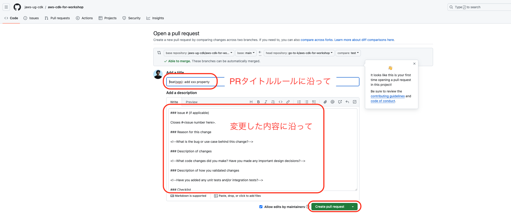

## コントリビュートの流れ

実際に AWS CDK にコントリビュートする際は、主に以下のフローで行います。

### 着手する issue を探したり、issue を経由せずにプルリクエストを出す内容を決める

本家リポジトリの issue を参照しましょう。また、issue を経由せずにプルリクエストを出す場合は、その内容を決めましょう。

### リポジトリのフォーク・クローン・ブランチのチェックアウト・ビルド

- [フォークからビルドまで](../フォークからビルドまで/fork-build.md)を参照
  - フォーク・クローンは初回のコントリビュート時のみで OK
  - 複数のプルリクエストを管理するため、上記リンクの通り、プルリクエストごとにブランチを切っておきましょう
- ※upstream(aws-cdk 本家)の main ブランチに更新があった場合、自分のフォークしたリポジトリに反映しておく
  - こちらは 2 回目以降のコントリビュートの際、またはフォークをしてから時間が経った場合に行います
  - GitHub 上のフォークした自身のリポジトリで `Update branch` ボタンで更新し、その後ローカルの main ブランチで `git pull` をします
    - upstream のブランチへの追跡は git コマンドでも可能ですが省略
  - ブランチを切る際は、更新後の main ブランチから切ると良いでしょう
    - ブランチを切った後に本家の更新を反映するには、`git pull origin main`コマンドを使用します。(git fetch + merge でも可)
    - また 2 回目以降のコントリビュートの際は、ローカルでビルドした時から変更があることが多いため、再度ビルドをしておくと良いでしょう
  - 

### ソースコードの変更

解決したい内容に従って、実際にソースコードを変更します。具体的なファイルは解決したい内容によって選択してください。

機能追加やバグ修正では、unit テストや integ テストのコードを追加して、変更が正しく動作することを確認します。

後述しますが、機能追加のプルリクエストでは README ファイルの更新も必要です。

### 更新部分のファイルの再ビルド

ソースコードを変更した場合、再度ビルドをしておく必要があります。

なお、初回のクローン時に行ったビルドコマンドは全てのモジュール・またはスコープのオプションによって`aws-cdk-lib`モジュール内のディレクトリ・ファイル全てのビルドになるため時間がかかることがあります。

もちろん最初に紹介したビルドコマンドでも構わないのですが、ここではモジュールより小さい粒度の、変更したファイルのディレクトリのみをビルドする方法も紹介します。

```sh
cd packages/aws-cdk-lib/aws-sqs
yarn tsc
```

こちらは、AWS CDK 特有ではなく TypeScript としてのビルド方法を適用しています。これにより、最小粒度でのビルドが可能になり、ビルド速度としては最速です。

また、予め`yarn watch`コマンドを実行しておくことで、コードの変更を検知して自動でビルドすることも可能ですので、こちらもオススメです(詳細は[こちら](https://github.com/aws/aws-cdk/blob/main/CONTRIBUTING.md#yarn-watch-optional))。

```sh
cd packages/aws-cdk-lib
yarn watch & # runs in the background
```

### unit テスト実行

機能追加やバグ修正などでは、unit テストを実行して、変更が正しく動作することを確認します。

既存の挙動に変更がないかどうか、またバグ修正の際に新たにテストを追加した場合も同じようにテストを実行して確認します。

```sh
cd packages/aws-cdk-lib/aws-sqs
yarn test
```

### integration テスト実行

AWS CDK では、`integ-tests-alpha`モジュールによる、integration テストが用意されています(もしくは**変更内容を確認できる integ テストファイルがなければ自分で新規ファイルを用意**します)。

こちらでは integ テストファイルをビルドし、それによる javascript ファイルへのトランスパイル後に生成された`integ.xx.js`を実行することになります。(**コンストラクト側のファイルも事前にビルドしておく必要があります。**)

```sh
cd packages/@aws-cdk-testing/framework-integ/test/aws-sqs
# integ ファイルのビルド/トランスパイルをして、javascript ファイルを生成
yarn tsc
# 実際にinteg テストを実行する
yarn integ aws-sqs/test/integ.sqs.js # jsファイルが生成されていることを確認してから
```

こちらにより、実際に AWS CDK による AWS 環境へのデプロイを実行し、正しくデプロイできるかを確認することができます。

こちらでは、まずデプロイ前に AWS CDK によって CloudFormation のテンプレートファイルが**スナップショットファイルとして**生成されます(同ディレクトリ内の`integ.sqs.js.snapshot`ディレクトリに保管)。すでに既存のスナップショットファイルがある場合、もし既存の CloudFormation テンプレートに変更がある、つまりスナップショットファイルに差分が生じた際は、テストコマンドが失敗します。

もし、CloudFormation テンプレート(スナップショット)に変更があるが、**それが機能追加やバグ修正による想定内の変更である場合**、`--update-on-failed`オプションによって、エラーを抑制し、既存のスナップショットファイルを更新することができます。

```sh
yarn integ aws-sqs/test/integ.sqs.js --update-on-failed
```

またそれらのテンプレートに、**破壊的変更がある場合にもエラーが発生するため**、この場合はコンストラクト側のコードを変更し、破壊的変更がないように修正する必要があります。

※破壊的変更: 既存のリソースが削除されたり置換されてしまうようなケース

integ テストでは実際に AWS 環境にデプロイした後、スタックを自動で削除する仕様になっていますが、もしデプロイ後に作成したリソースをマネージメントコンソールなどで確認したい場合、`--no-clean`オプションを指定することで、スタックを自動削除しないようにすることができます。

```sh
yarn integ aws-sqs/test/integ.sqs.js --no-clean --update-on-failed
```

### プルリクエスト提出

ここまでで、実際のコンストラクトコードの変更、またテストの実行が成功したら、GitHub にプルリクエストを提出します。

まず、ローカルのブランチで、変更したファイルを push します。

```sh
git add . # もしくは実際に変更したファイルを直接指定
git commit -m "feat(sqs): add xxx property" # コミットメッセージは適宜変更
git push origin workshop-guide-1 # ブランチ名は適宜変更
```

そして、フォークしたリポジトリをブラウザで開くとこのようなダイアログが出力されているので、このまま GitHub 上でプルリクエストを提出します。


Pull Request のルール(後述)に沿ってタイトルや本文を記載し、プルリクエストを提出します。



## PR ルール

Pull Request (PR) を提出する際のルールを以下に示します。

まず、PR タイトルですが、以下のように、`種類(モジュール): 説明`のような記載にしてください。

また基本的には、**全て小文字**にしてください。（固有名詞やプロパティ名などには大文字を使っても構いません：TLS, MySQL, `maxMessageSizeBytes`, etc...）

- feat(sqs): add `maxMessageSizeBytes` property

### Conventional Commits

最初の`feat` 部分には、今回の PR で変更する内容に沿って、[Conventional Commits](https://www.conventionalcommits.org/en/v1.0.0/) (feat, fix, chore, docs, test, etc...)に従って記載してください。

特に機能追加(feat)、バグ修正(fix)の場合は、**以下のファイルを差分に含める**必要があります。(含めない場合、AWS CDK リポジトリで自動発火する CI でエラーになります)

- feat
  - unit tests
  - integ tests + snapshots
  - README
- fix
  - unit tests
  - integ tests + snapshots

### モジュール

`feat(sqs)`の`(sqs)`の部分には、変更した AWS サービスのモジュール名称を記載してください。

なお、以下のルールに注意してください。

- `aws-sqs`などの prefix の`aws-`部分は省略する
- α モジュールの場合の`-alpha`も省略する
  - `aws-apprunner-alpha` -> `apprunner`

### fix の場合の注意

バグ修正(fix)の場合、PR タイトルには、「このような変更をした」ではなく、「このようなバグがあった」という旨を記載してください。

- NG タイトル
  - fix(sqs): use `xxx` instead of `yyy`
- OK タイトル
  - fix(sqs): failed to create queue when `xxx` is specified

### 補足

- 実際の PR では、PR 提出後に自動で CodeBuild による CI(ビルド・lint・テスト) が走ります
  - **ワークショップでは PR 提出後の CI を提供していません**
- feat, fix では unit tests, integ tests, README の変更をしないと CodeBuild CI がエラーになりますが、変更内容に対してそれらは不要であると主張したい場合(たとえば unit テストのみで変更内容がカバーできる場合など)は、PR のコメントに以下のコメントをすると、**メンテナーが不要と判断した場合にのみ**、差分に含めなくても良くなります
  - `Exemption Request: 理由`
  - ただし、なるべくこれは行わず、PR ルールに沿って変更を行うようにしましょう

## コントリビュートガイド・デザインガイド

コントリビュートをする際、今回のワークショップで説明できなかった注意点も多々あります。以下の公式リンクを参照してください。

- [CONTRIBUTING](https://github.com/aws/aws-cdk/blob/main/CONTRIBUTING.md)
- [DESIGN_GUIDELINES](https://github.com/aws/aws-cdk/blob/main/docs/DESIGN_GUIDELINES.md)

また、k.goto が個人で公開している資料にも注意点・実装 TIPS などが公開されているため、こちらも良ければご覧下さい。

- [AWS CDK コントリビュート TIPS](https://speakerdeck.com/gotok365/aws-cdk-contribution-tips)
